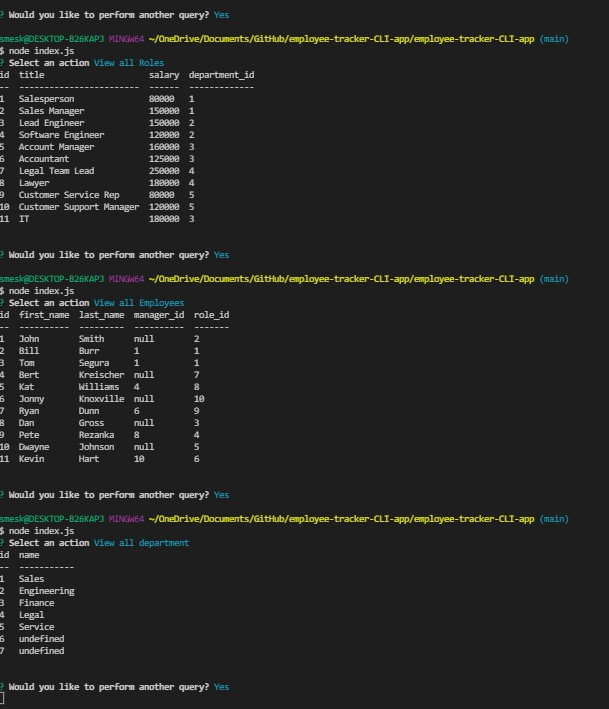

# employee-tracker-CLI-app
command-line application to manage a company's employee database, using Node.js, Inquirer, and MySQL.

## Description
- This application will accept inputs for employees, roles, and departments  and their details then input the data to our MySql database
- This application allows a user to keep track of their department, roles, and employees and key information about them

## Table of Contents

- [License](#license)
- [Installation](#installation)
- [Usage](#usage)
- [Features](#features)
- [Credits](#credits)
- [Tests](#tests)
- [Questions](#questions)
- [Contribute](#Contribute)

## License

- Unlicensed

Refer to [https://choosealicense.com/](https://choosealicense.com/).

## Installation

To install this application, please follow the steps below:
- Use 'npm i' to install inquirer, mysql2, dotenv, and consoleTable. Then open index.js in the integrated erminal using node index.js. Answer the prompts and your inputs will produce results!

## Usage

![Recording of Application] https://youtu.be/dT4b7zYEDns

## Features

- View all roles, departments and employees
- CRUD operations for employees, role and department
- Table Views of database

## Credits

- NPM
- MySQL

## Questions 

If you have any questions about the repo, open an issue or contact me directly at undefined. You can find more of my work at [smeske10](https://github.com/smeske10/).

## Contribute

- Contact me directly at my GitHub

The [Contributor Covenant](https://www.contributor-covenant.org/) is an industry standard, but you can always write your own if you'd prefer.

